# Motion Planning with A* and RRT

# Overview
This project utilizes weighted A* and RRT to have our agent compute a minimal cost path from a specified start point to a specified goal point. Our agent is required to find this path while avoiding obstacles and without stepping outside of boundaries. We use search-based and sampling-based planning algorithms to solve this problem, namely, weighted A* and Rapidly exploring Random Tree (RRT), respectively.

# Implementation
This was implemented in Python using NumPy. The code has been redacted, if you wish to see it, you may contact me at charles.lychee@gmail.com

# Results
## Search-Based Planning - A* Algorithm
<table style='table-layout: fixed;'>
    <tr>
        <td>
        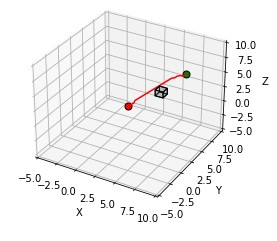
        <figcaption>Single Cube</figcaption>
        </td>
        <td>
        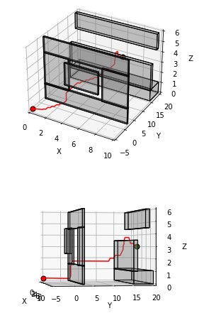
        <figcaption>Window</figcaption>
        </td>
    </tr>
    <tr>
        <td>
        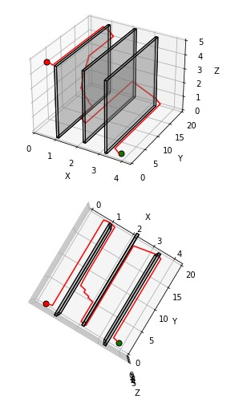
        <figcaption>Monza</figcaption>
        </td>
        <td>
        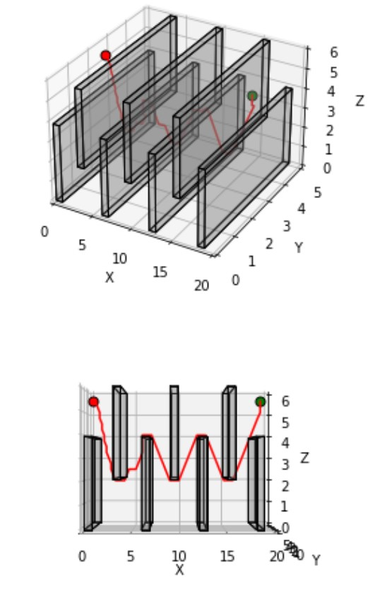
        <figcaption>Flappy</figcaption>
        </td>
    </tr>
    <tr>
        <td>
        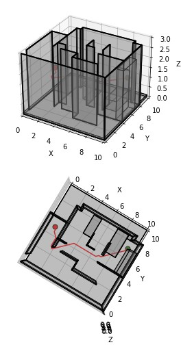
        <figcaption>Room</figcaption>
        </td>
        <td>
        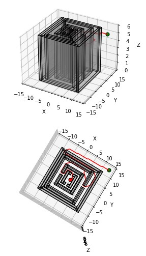
        <figcaption>Maze</figcaption>
        </td>
    </tr>
    <tr>
        <td>
        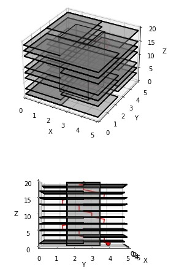
        <figcaption>Tower</figcaption>
        </td>
    </tr>
</table>

## Sampling-Based Planning - RRT Algorithm
<table style='table-layout: fixed;
    width: 100%;'>
    <tr>
        <td>
        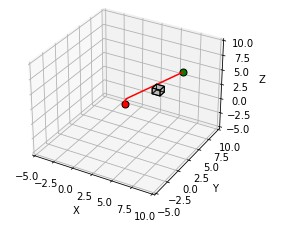
        <figcaption>Single Cube</figcaption>
        </td>
        <td>
        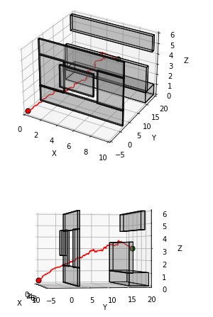
        <figcaption>Window</figcaption>
        </td>
    </tr>
    <tr>
        <td>
        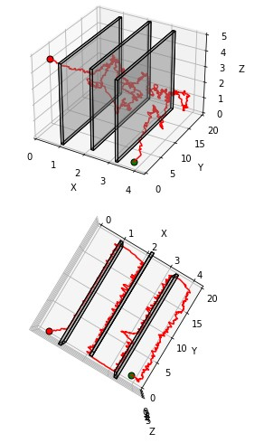
        <figcaption>Monza</figcaption>
        </td>
        <td>
        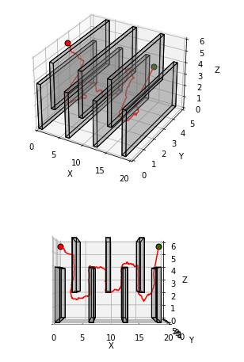
        <figcaption>Flappy</figcaption>
        </td>
    </tr>
    <tr>
        <td>
        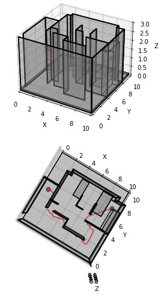
        <figcaption>Room</figcaption>
        </td>
        <td>
        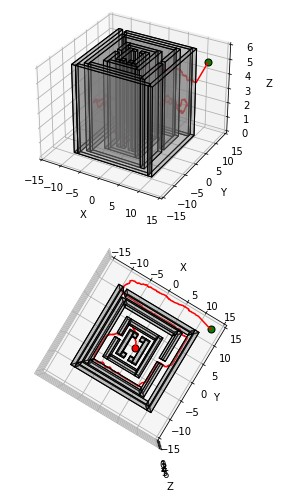
        <figcaption>Maze</figcaption>
        </td>
    </tr>
    <tr>
        <td>
        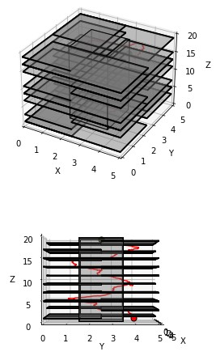
        <figcaption>Tower</figcaption>
        </td>
    </tr>
</table>

# Mathematical Approach
## Problem Formulation
We formulate the problem as a Deterministic Shortest Path (DSP) problem.

```math
\text{Vertex Set}: \mathcal{V} = \mathbb{Z}^3 = \{\mathbf{x} = \begin{pmatrix}
        x\\
        y\\
        z
    \end{pmatrix}: x, y, z \in \mathbb{Z}\}
```

```math
\begin{split}
    \text{Edge Set}: \mathcal{E} = \{&\begin{pmatrix}
        x\pm1\\
        y\\
        z
    \end{pmatrix}, \begin{pmatrix}
        x\\
        y\pm1\\
        z
    \end{pmatrix}, \begin{pmatrix}
        x\\
        y\\
        z\pm1
    \end{pmatrix}, \\
    &\begin{pmatrix}
        x\pm1\\
        y\pm1\\
        z
    \end{pmatrix}, \begin{pmatrix}
        x\\
        y\pm1\\
        z\pm1
    \end{pmatrix}, \begin{pmatrix}
        x\pm1\\
        y\\
        z\pm1
    \end{pmatrix}: \begin{pmatrix}
        x\\
        y\\
        z
    \end{pmatrix} \in \mathcal{V}\}
\end{split}
```

```math
\text{Edge Weights}: \mathcal{C} = \{c_{ij} = ||\mathbf{x}_i - \mathbf{x}_j||_2 : i,j \in \mathcal{V}\}
```

```math
\text{Path}: i_{1:q} := (i_1, i_2, ..., i_q) : i_k \in \mathcal{V}
```

```math
\text{Path Length}: J^{i_{1:q}} = \sum_{k=1}^{q-1} c_{i_k, i_{k+1}}
```

```math
\text{Set of All Paths Connecting } s \text{ to } \tau:\mathcal{P}_{s,\tau} := \{i_{1:q} : i_k \in \mathcal{V}, i_1 = s, i_q = \tau\}
```

### Objective
Find the path between start node $s$ and terminal node $\tau$ that minimizes path length
```math
i^*_{1:q} = \arg \min_{i_{1:q} \in \mathcal{P}_{s, \tau}} J^{i_{1:q}}
```

## A* Algorithm
This algorithm is essentially an informed version of Djikstra's algorithm. We inform this algorithm by provide a heuristic function $h_k$ which provides prior knowledge about the distance from a node $k$ to the terminal node $\tau$.

### Heuristic Function
We choose the heuristic function to be
$$h_k = ||k - \tau||_2$$
since we are searching through a 3D-Euclidean space.

### Epsilon Sub-Optimality
We can bias our search to trust the heuristic more by weighting the heuristic function by $\epsilon$ for when deciding which node to pop from our priority queue. This will result in a path that is $\epsilon$-suboptimal. By weighting, it is possible that we can reduce our search time if our heuristic closely matches the true distance of a given node to the terminal node.

The algorithm is as follows:
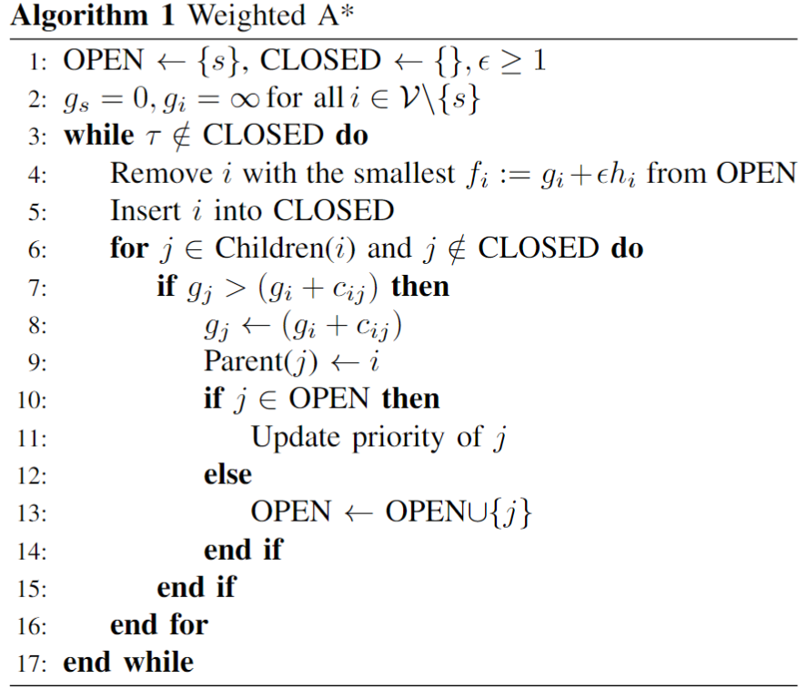

## RRT
This algorithm is not optimal, however, it usually will result in significantly less nodes considered than A*. This is because RRT doesn't need to search node by node, but instead, samples nodes from the full vertex set and connects them to existing paths. This also results in paths generated by RRT to be jagged.
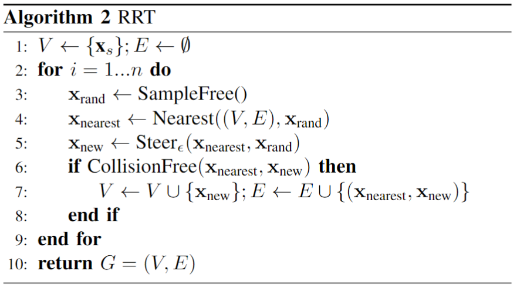

# Runtime
We expect time complexity of A* to be $O(|V|^2\log|V|)$ and the space complexity $O(|V|)$.

We cannot assigned a time complexity or space complexity to RRT because it randomly samples nodes for its search.

The observed runtimes are as follows:

| Algorithm | Map | Num Considered Nodes |Runtime |
| -- | -- | -- | --|
|A* | Single Cube | 726 | 0.537 |
|A* | Maze | 1149017 | 867.836 |
|A* | Flappy Bird | 41727 | 26.116 |
|A* | Monza | 67038 | 64.614 |
|A* | Window | 3851 | 1.982 |
|A* | Tower | 12816 | 12.416 |
|A* | Room | 37332 | 36.465 |
|RRT | Single Cube | 83 | 0.0428 |
|RRT | Maze | 145475 | 143.999 |
|RRT | Flappy Bird | 6382 | 3.434 |
|RRT | Monza | 605665 | 373.060 |
|RRT | Window | 2137 | 1.551 |
|RRT | Tower | 15118 | 10.177 |
|RRT | Room | 2561 | 1.590 |